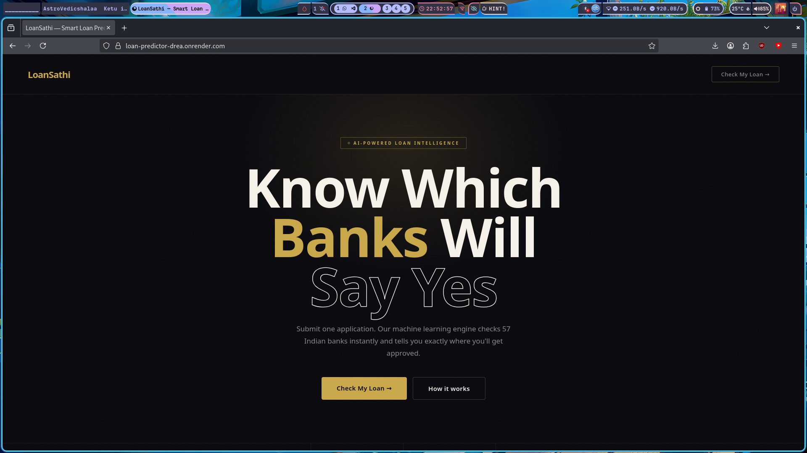
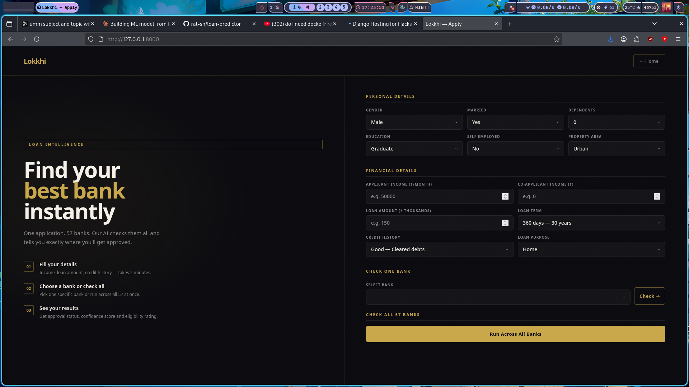
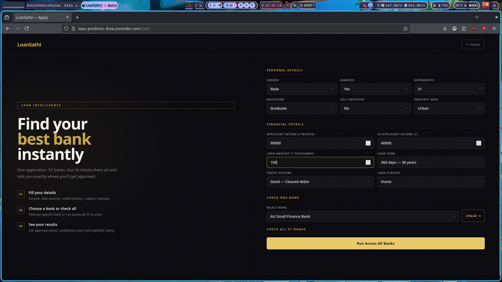
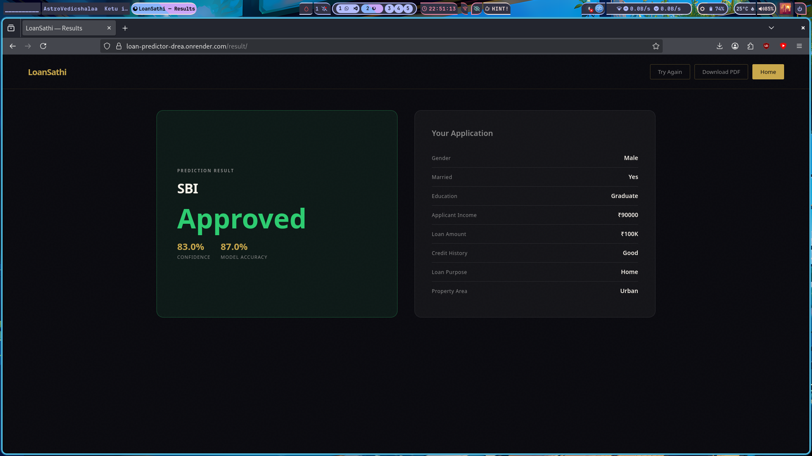
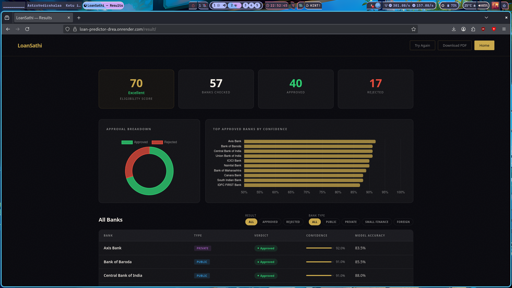
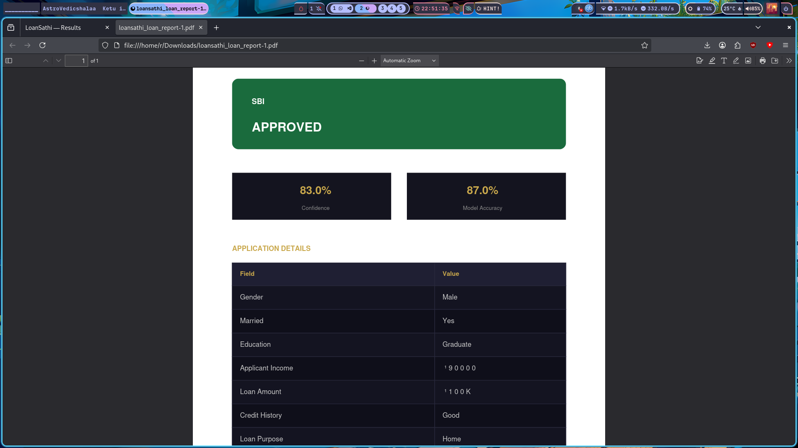

# LoanSathi — AI-Powered Loan Predictor

> One application. 57 Indian banks. Instant ML-powered approval prediction.

**Live Demo** → [loan-predictor-drea.onrender.com](https://loan-predictor-drea.onrender.com)

---

## Screenshots

### Home Page


### Application Form



### Single Bank Result


### All Banks Result


### PDF Report


---

## Why LoanSathi?

| Feature | LoanSathi | Other Tools |
|---|---|---|
| Banks covered | 57 | 1–5 |
| Prediction time | < 2 seconds | Days |
| Apply separately | No — one form | Yes |
| Confidence score | Yes | No |
| PDF report | Yes | No |
| Free to use | Yes | No |
| No account needed | Yes | No |

---

## What is LoanSathi?

LoanSathi predicts loan approval chances across 57 Indian banks simultaneously. Fill one form, get instant results showing which banks will approve your loan — with confidence scores, charts, and a downloadable PDF report.

---

## Tech Stack

| Layer | Technology |
|---|---|
| Backend | Django 5.2 |
| ML | scikit-learn — Random Forest |
| Data | pandas, numpy |
| Frontend | HTML, CSS, JavaScript |
| Charts | Chart.js |
| PDF | jsPDF + AutoTable |
| Server | Gunicorn + Whitenoise |
| Container | Docker |
| Hosting | Render.com |

---

## Project Structure

```
mysite/
├── Dockerfile
├── requirements.txt
├── manage.py
├── data/
│   ├── train.py                       # Training script
│   └── natural_bank_datasets.zip      # Dataset (57 bank CSVs)
├── models/                            # 57 trained .pkl files (via Git LFS)
├── screenshots/                       # App screenshots
├── myapp/
│   └── views.py
├── mysite/
│   ├── settings.py
│   └── urls.py
└── templates/
    ├── home.html
    ├── loan_form.html
    └── result.html
```

---

---

# OPTION A — Quick Run (Models Included)

> Just want to run the app immediately? Models are already included via Git LFS — no training needed.

### Requirements
- Git
- Git LFS
- Docker

---

### Step 1 — Install Git LFS

**Linux / WSL**
```bash
sudo apt install git-lfs -y
git lfs install
```

**Mac**
```bash
brew install git-lfs
git lfs install
```

**Windows**
Download from https://git-lfs.com and install, then run:
```bash
git lfs install
```

---

### Step 2 — Clone the repo

```bash
git clone https://github.com/rat-sh/loan-predictor.git
```

---

### Step 3 — Enter the project folder

```bash
cd loan-predictor/mysite
```

---

### Step 4 — Verify models are downloaded

```bash
ls models/ | wc -l
```

Should print `57`. If not, run:

```bash
git lfs pull
ls models/ | wc -l
```

---

### Step 5 — Build Docker image

```bash
docker build -t loansathi .
```

First time takes 3–5 minutes.

---

### Step 6 — Run the app

```bash
docker run -p 8000:8000 loansathi
```

You should see:
```
[INFO] Starting gunicorn
[INFO] Listening at: http://0.0.0.0:8000
```

---

### Step 7 — Open in browser

```
http://127.0.0.1:8000
```

| Page | URL |
|---|---|
| Home | `http://127.0.0.1:8000/` |
| Apply | `http://127.0.0.1:8000/loan/` |
| Results | `http://127.0.0.1:8000/result/` |

---

Press `Ctrl + C` to stop.

---

---

# OPTION B — Build From Scratch

> Want to understand the ML side and train your own models?

### Requirements
- Git
- Docker
- Google account (for Google Colab — free)

---

### Step 1 — Clone the repo

```bash
git clone https://github.com/rat-sh/loan-predictor.git
cd loan-predictor/mysite
```

---

### Step 2 — Open Google Colab

Go to [colab.research.google.com](https://colab.research.google.com) and click **File → New Notebook**.

---

### Step 3 — Upload files to Colab

In the left sidebar click the **Files icon**.

Upload both of these from your cloned repo:
- `data/train.py`
- `data/natural_bank_datasets.zip`

Both must be in the same location (default `/content/` folder in Colab).

---

### Step 4 — Run the training script

In a Colab cell run:

```python
exec(open("train.py").read())
```

This will:
- Extract the zip automatically
- Train a Random Forest model for all 57 banks
- Print accuracy and F1 score per bank
- Save all models as `.pkl` files in a `models/` folder

Training takes around **5–10 minutes**.

When finished you will see:
```
Done — 57/57 banks trained successfully
Models saved in 'models/'
Average Accuracy : 0.92x
```

---

### Step 5 — Download models from Colab

In the Colab Files panel — right click `models/` → **Download**.

This saves `models.zip` to your computer.

---

### Step 6 — Place models in the project

Extract `models.zip` and copy the folder into your cloned repo:

```bash
cp -r ~/Downloads/models  ~/path/to/loan-predictor/mysite/models
```

Verify:
```bash
ls ~/path/to/loan-predictor/mysite/models | wc -l
# should print 57
```

---

### Step 7 — Build and run

```bash
cd loan-predictor/mysite
docker build -t loansathi .
docker run -p 8000:8000 loansathi
```

Open `http://127.0.0.1:8000`

---

---

## Common Errors

**Dropdown is empty on the form page**

The `models/` folder is missing or empty.
```bash
ls mysite/models/ | wc -l
# Option A: run git lfs pull
# Option B: redo Step 5–6
```

**Docker build fails**

Make sure you are inside the `mysite/` folder (where `Dockerfile` exists):
```bash
cd loan-predictor/mysite
docker build -t loansathi .
```

**Port already in use**

```bash
docker stop $(docker ps -q)
docker run -p 8000:8000 loansathi
```

**App loads but predictions not working**

Verify `models/` is inside `mysite/` — same level as `manage.py` and `Dockerfile`.

---

## ML Details

| Detail | Value |
|---|---|
| Algorithm | Random Forest |
| Algorithms compared | 7 (KNN, Naive Bayes, Decision Tree, Logistic Regression, SVM, Gradient Boosting, Random Forest) |
| Banks trained | 57 |
| Records | 57,000+ loan applications |
| Model per bank | Yes — each bank has its own `.pkl` |
| Average accuracy | ~92% |

---

## License

MIT — free to use, modify and distribute.
